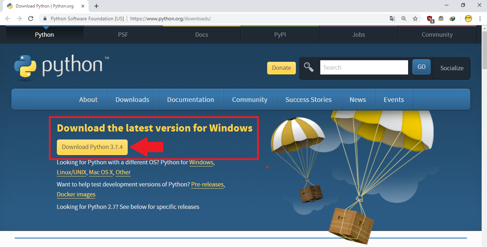
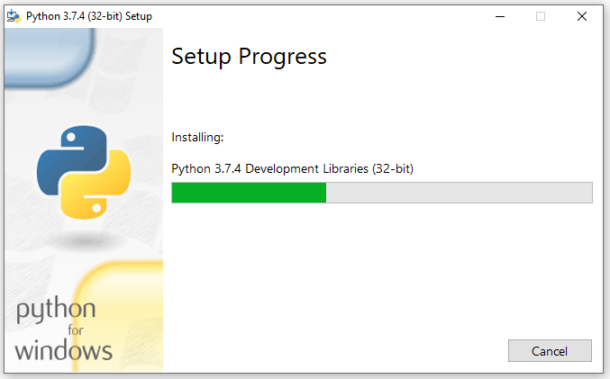

## Projeto desenvolvido para criar uma interface de dados recebidos via comunicação serial e a GUI do Windows

 <a href="#Requisitos">Requisitos</a> •
 <a href="#Instalação">Instalação</a> • 
 <a href="#Inicializar">Inicializar</a> • 

## Requisitos

É necessário que esteja instalado o [Python](https://www.python.org/ftp/python/3.9.5/python-3.9.5-amd64.exe) https://www.python.org/ftp/python/3.9.5/python-3.9.5-amd64.exe na máquina.

## Instalação

Depois de instalar o Python, execute o arquivo [installPythonModules.bat](./installPythonModules.bat), responsável por instalar os pacotes necessários para o funcionamento do serviço.

## Inicializar

O serviço pode ser inicializado executando o arquivo [main.exe](./dist/main/main.exe).

---

## Autor

<b>Gabriel Manfroi</b></a>
 

